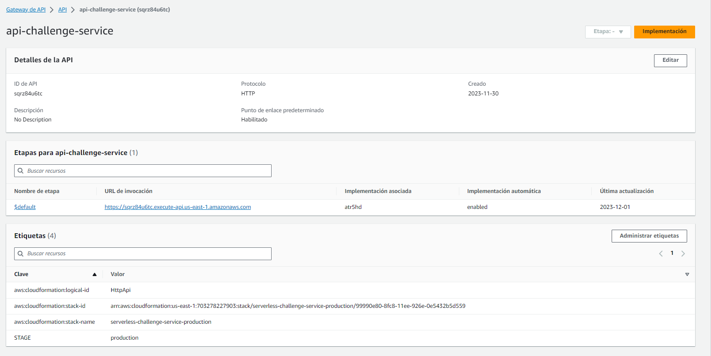

<p align="center">
  <a href="http://nestjs.com/" target="blank"></a>
</p>

</p>
  <!--[](https://opencollective.com/nest#backer)
  [](https://opencollective.com/nest#sponsor)-->

[Nest](https://github.com/nestjs/nest) framework TypeScript starter repository.

- Author - [Néstor Daniel Gomez](https://www.linkedin.com/in/nestordanielgomez1/)
- Website - [hhttps://portfolio-nestor-gomez.netlify.app/](https://portfolio-nestor-gomez.netlify.app/)
- Github - [@repositories](https://github.com/NestorDanielGomez?tab=repositories)

## Instalación del proyecto.

- Clonar proyecto

```bash
$ npm install
```

- Clonar y renombrar el archivo `.env.template` por `.env`.
- Cambiar las variables de entorno segun ambito de desarrollo. Dentro el archivo .env se detalla que variables utilizar según el caso de uso.
- Levantar la Base de datos:

```bash
$ docker-compose up -d
```

- Correr proyecto en modo desarrollo:
- Link de swagger (con la App levantada en modo dev) para ver detalle de los Endpoints:
  ```
  http://localhost:3000/api#/employee/
  ```

````

```bash
  $ npm run start:dev
````

#### Llevar la aplicacion hacia AWS.

- Con las credenciales de AWS ingresadas por consola.
  ejecutar:

```bash
 serverless deploy
```

#### DEPLOY EN AWS:

```
https://sqrz84u6tc.execute-api.us-east-1.amazonaws.com/employee
```

- Ejemplo getAll y GetOne desde la app desplegada en aws

  - 

- Gateway de Api para manejo de las peticiones.
  

- Función lambda para ejecutar las peticiones.
- ARN de la función:arn: aws:lambda:us-east-1:703278227903:function:serverless-challenge-service-production-api
  

- Nombre de recurso de Amazon (ARN): arn:aws:rds:us-east-1:703278227903:db:db-challenge-instance
  

#### CI/CD.

- Deploy de ServerLess sobre los pushes en la rama "main".
  /github/workflows/main.yml

#### Todo

- Generar una tabla independiente para el cargo y relacionarla con la tabla de empleados.
- Validaciones mas espeficas de tipo de dato a recibir.
- Generar un objeto de configuracion para el manejo de las variables de entorno segun el stage (dev/prod).
- Generar un endpoint "seed" que carge la base de datos local cuando se inicializa el proyecto, para ya tener "empleados" cargados para probar todos los endpoints.
- Dockerizar (multi-stage) la aplicación ya terminada.
